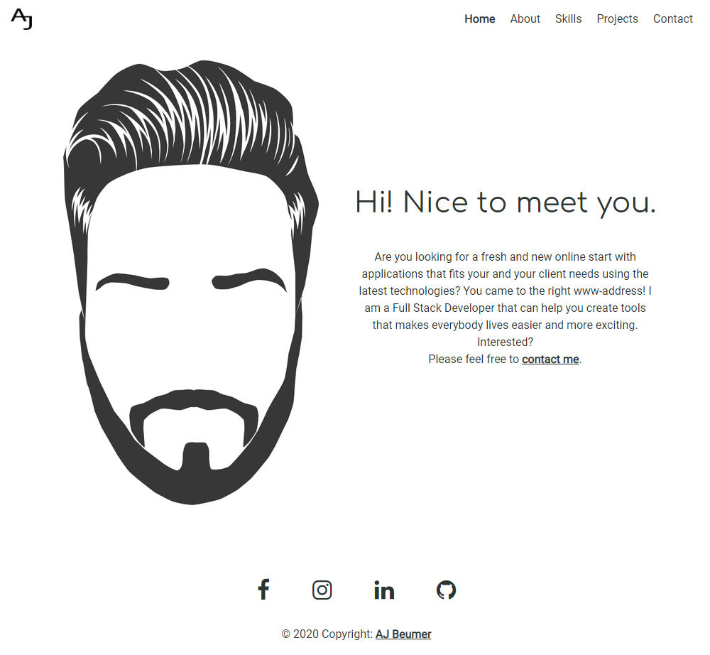

<h1 align="center">
User Centric Frontend Development - Milestone Project 1 - Personal Website - Aart-Jan Beumer
</h1>

<h1>

</h1>
 
For Milestone Project 1 I decided to build my personal website with the idea to inform the visitors who I am, what I made and what I can do.
 
 

[Visit my personal site here](https://ajbeumer.github.io/personal-website/)
 
[Visit my GitHub repository here](https://github.com/AJBeumer/personal-website)

## Table of Content

1. [**UX**](#ux)
    - [**Project Purpose**](#project-purpose)
    - [**User Experience**](#user-experience)
    - [**User Stories**](#user-stories)
    - [**Design Ideas**](#design-ideas)
    - [**Wireframes**](#wireframes)
    - [**Developer and Business Purpose**](#developer-and-business-purpose)

2. [**Features**](#features)
    - [**Existing Features**](#existing-features)
    - [**Features Left to Implement**](#features-left-to-implement)

3. [**Technologies Used**](#technologies-used)

4. [**Testing**](#testing)

5. [**Deployment**](#deployment)

6. [**Credits**](#credits)
    - [**Contents**](#contents)
    - [**Media**](#media)
    - [**Help with code**](#help-with-code)
    - [**Acknowledgements**](#acknowledgements)

7. [**Disclaimer**](#disclaimer)

## UX

### Project Purpose

The main purpose of this website is to show people who I am, what I can do for them and what I am capable of. The site is mainly for recruiters and people who would like to work together.

### User Experience

- Visitors of the site will visit a website that works exactly as they expect. They will know without thinking how to navigate and interact through the site.
- The site is based upon a minimalistic approach to focus on the content without distraction.
- Efficiency was big part of the site, the visitor always knows where they are on the site and how to proceed. When visiting a page its also visible in the menu which page is active. 

### User Stories

As a recruiter I would like to see:

- examples of completed projects
- previous work experience
- what kind of knowledge the person has
- an ability to make contact easily

As a person who would like to collaborate I would like to see:

- examples of completed projects
- what kind of knowledge the person has
- an ability to make contact easily
- proof of capability (github)

### Design Ideas

##### Fonts:

- [Roboto](https://fonts.google.com/specimen/Roboto?query=roboto) is used as a primary font because of the friendly look and easy to read for visitors.
- [Comfortaa](https://fonts.google.com/specimen/Comfortaa?query=Comfortaa) is used for headers to create an open and slim look.

##### Colors:

The site makes use of 2 different colors: 
- RGB(44,53,49) or (#2C3531) is a dark-grey color used throughout the entire website. The reason for using the color is to create a softer look what black will create.
- RBG(94,149,90) or (#5E955A) is a warm green color. Green was chosen as a secondary color as it represents a new beginning and growth. To use a warmer green color would create a more relaxing experience.

##### Styling:
For styling a minimalistic approach was chosen to give a clean look and put the focus more on the content.
 
 
 Special styles include:
- <b>general links</b> - the links make use of `font-weight: 600;` and `text-decoration: underline;` and a subtle hover-effect that changes the color.
- <b>menu items</b> - when hovering the menu the items are visibly shown with `color: #5E955A !important;` and an `text-decoration: underline;`. When menu item is `.active` the `font-weight` is changed to `font-weight: 600;`.
- <b>project overlay</b> - the overlay is using `backgroundColor: 'rgba(0,0,0,.5)'` to give it a darker opacity to clearly show the text but still shows the underlying image.
- <b>buttons | social media icons</b> - the main color grey is used for these to include them in the styling and hovering the items will give the secondary green color which creates a nice subtle effect.

##### Profile image:
The website does not use any background styling, but a graphical profile image. The image is designed by the partner of the developer and represents yours truly.

### Wireframes
Wireframes were made using Balsamiq for a clean looking design layout.

- Desktop Wireframes

- Tables Wireframes

- MobileWireframes

### Developer and Business Purpose
