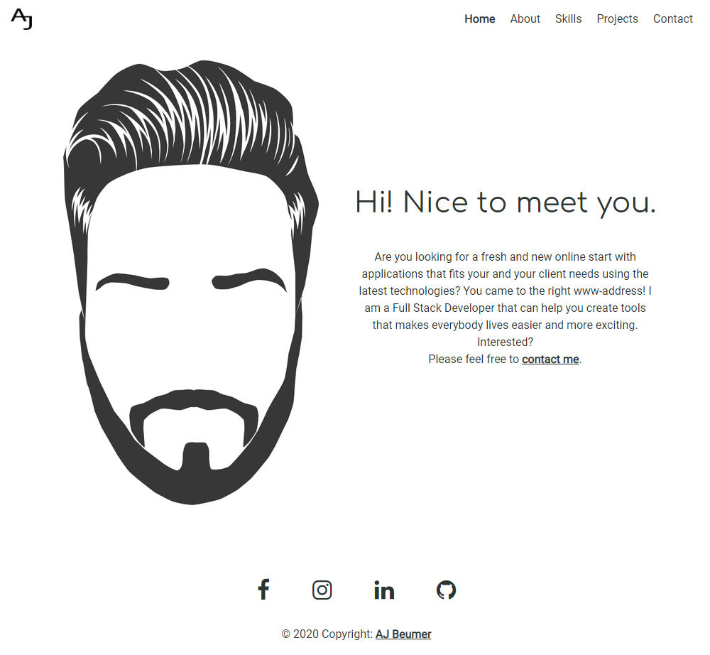

<h1 align="center">
User Centric Frontend Development - Milestone Project 1 - Personal Website - Aart-Jan Beumer
</h1>

<h1>

</h1>
 
For Milestone Project 1 I decided to build my personal website with the idea to inform the visitors who I am, what I made and what I can do.
 
 

[Visit my personal site here](https://ajbeumer.github.io/personal-website/)
 
[Visit my GitHub repository here](https://github.com/AJBeumer/personal-website)

## Table of Content

1. [**UX**](#ux)
    - [**Project Purpose**](#project-purpose)
    - [**User Experience**](#user-experience)
    - [**User Stories**](#user-stories)
    - [**Design Ideas**](#design-ideas)
    - [**Wireframes**](#wireframes)
    - [**Developer and Business Purpose**](#developer-and-business-purpose)

2. [**Features**](#features)
    - [**Existing Features**](#existing-features)
    - [**Features Left to Implement**](#features-left-to-implement)

3. [**Technologies Used**](#technologies-used)

4. [**Testing**](#testing)

5. [**Deployment**](#deployment)

6. [**Credits**](#credits)
    - [**Content**](#content)
    - [**Media**](#media)
    - [**Help with code**](#help-with-code)
    - [**Acknowledgements**](#acknowledgements)

7. [**Disclaimer**](#disclaimer)

## UX

### Project Purpose

The main purpose of this website is to show people who I am, what I can do for them and what I am capable of. The site is mainly for recruiters and people who would like to work together.

### User Experience

- Visitors of the site will visit a website that works exactly as they expect. They will know without thinking how to navigate and interact through the site.
- The site is based upon a minimalistic approach to focus on the content without distraction.
- Efficiency was big part of the site, the visitor always knows where they are on the site and how to proceed. When visiting a page its also visible in the menu which page is active. 

### User Stories

As a recruiter I would like to see:

- examples of completed projects
- previous work experience
- what kind of knowledge the person has
- an ability to make contact easily

As a person who would like to collaborate I would like to see:

- examples of completed projects
- what kind of knowledge the person has
- an ability to make contact easily
- proof of capability (github)

### Design Ideas

##### Fonts:

- [Roboto](https://fonts.google.com/specimen/Roboto?query=roboto) is used as a primary font because of the friendly look and easy to read for visitors.
- [Comfortaa](https://fonts.google.com/specimen/Comfortaa?query=Comfortaa) is used for headers to create an open and slim look.

##### Colors:

The site makes use of 2 different colors: 
- RGB(44,53,49) or (#2C3531) is a dark-grey color used throughout the entire website. The reason for using the color is to create a softer look what black will create.
- RBG(94,149,90) or (#5E955A) is a warm green color. Green was chosen as a secondary color as it represents a new beginning and growth. To use a warmer green color would create a more relaxing experience.

##### Styling:
For styling a minimalistic approach was chosen to give a clean look and put the focus more on the content.
 
 
 Special styles include:
- <b>general links</b> - the links make use of `font-weight: 600;` and `text-decoration: underline;` and a subtle hover-effect that changes the color.
- <b>menu items</b> - when hovering the menu the items are visibly shown with `color: #5E955A !important;` and an `text-decoration: underline;`. When menu item is `.active` the `font-weight` is changed to `font-weight: 600;`.
- <b>project overlay</b> - the overlay is using `backgroundColor: 'rgba(0,0,0,.5)'` to give it a darker opacity to clearly show the text but still shows the underlying image.
- <b>buttons | social media icons</b> - the main color grey is used for these to include them in the styling and hovering the items will give the secondary green color which creates a nice subtle effect.

##### Profile image:
The website does not use any background styling, but a graphical profile image. The image is designed by the partner of the developer and represents yours truly.

### Wireframes
Balsamiq is used to create wireframes of the site for desktop, tablet and mobile view.

- [Home page](assets/readmeImages/Home.png)
- [About page](assets/readmeImages/About.png)
- [Skills page](assets/readmeImages/Skills.png)
- [Projects page](assets/readmeImages/Projects.png)
- [Contact page](assets/readmeImages/Contact.png)

### Developer and Business Purpose
1. Demonstration of learned skills (HTML5/CSS/Bootstrap) throughout the first modules
2. Good website to use for portfolio

## Features

### Existing Features

## Technologies Used
This project made use of the following technologies:

- HTML | CSS | bit of JavaScript - HTML5 and CSS3 was used for the styling of the website and Javascript was used for the navigation menu and hover effect on the projects page.

- [WebStorm](https://www.jetbrains.com/webstorm/) - the IDE to develop the website

- [GitHub](https://github.com/) - to backup the code, to store code for others to review and to deploy the code

- [Google Fonts](https://fonts.google.com/) - to provide the fonts for the website

- [Font Awesome](https://fontawesome.com/) - to provide the social media icons

- [Bootstrap](https://getbootstrap.com/) - to provide an easy grid-system and easy to use components

## Testing

I tested the validity of my code by using [W3C Markup Validation Service](https://validator.w3.org/) to ensure my HTML was valid. Also the build in validator in my IDE [WebStorm](https://www.jetbrains.com/webstorm/) helped me validate and format my code.

### Testing devices
I tested the site on two different machines:
1) Windows OS with a 3440x1400 screen. Browsers used for testing: Chrome (version 81.0.4044.138), Firefox (version 76.0.1), Microsoft Edge (version 44.18362.449.0), Internet Explorer (version 11.836.18362.0)
2) MacBook Pro with a 2880x1800 screen. Browsers used for testing: Chrome (version 81.0.4044.138), Safari (version 13.1)

In the development tools of Chrome I tested the site on all the different mobile devices and tablets to ensure the site, not only looked, but also worked the same as expected.
 The styling (CSS) of the site was tested throughout development to make sure styling would look exactly the same on all the browsers and devices. 

All tests are similar in all the different browsers. 

##### Testing navigation menu

The steps I took to test the navigation menu are:
1) Hover over the navigation items (Home | About | Skills | Projects | Contact) on all the pages to see if the expected hover effect worked.
2) Clicked all the navigation items (Home | About | Skills | Projects | Contact) on all the pages to test if the links worked and were referring to the correct page.
3) Clicked on the top left logo on all the pages to see if the link to index.html worked.
4) Resized the browser to make sure the menu items were replaced with a button which is set to 992px screen width.
5) Clicked all the navigation items in the dropdown menu (Home | About | Skills | Projects | Contact) on all the pages to test if the links worked and were referring to the correct page.

##### Testing footer content

The steps I took to test the footer content:
1) Hover over the social media icons (Facebook | Instagram | LinkedIn | Github) on all the pages to see if the expected hover effect worked.
2) Clicked all the social media icons (Facebook | Instagram | LinkedIn | Github) on all the pages to test if the links were referring to the correct external site.
3) Hover over the "AJBeumer" link in the copyright text on all the pages to see if the expected hover effect worked.
4) Clicked on the "AJBeumer" link in the copyright text on all the pages to see if the link referred to the correct external website.

##### Testing Home page

In the home page (besides the navigation menu and footer) the following was tested:
1) Hover over the "Contact me" link in the text, to see if the expected hover effect worked.
2) Clicked on the "Contact me" link in the text to see if it referred me to the Contact page.
3) Resized the browser to test if the content goes below the profile image at 767px screen width.

##### Testing About Page

## Credits

### Content

All the content has been created by the developer. 

### Media

All the media has been created by the developer.

### Help with code

- 

### Acknowledgements

I want to thank:

- my mentor Spencer Barriball (spence_mentor) for keeping me on track, giving tips on how to solve difficulties I was running into and where to focus.

### Disclaimer

The information contained in this website is for general information and educational purposes only. 

